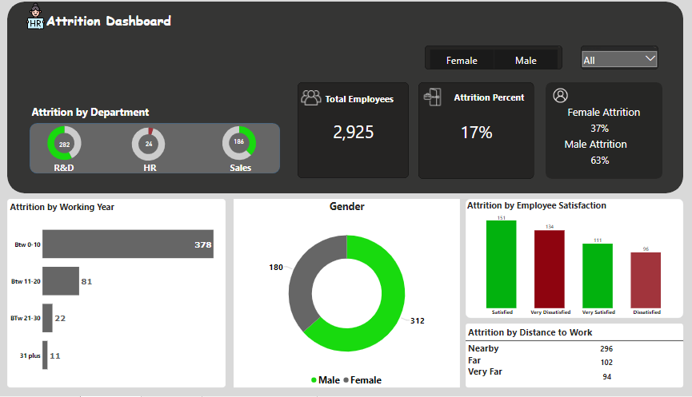
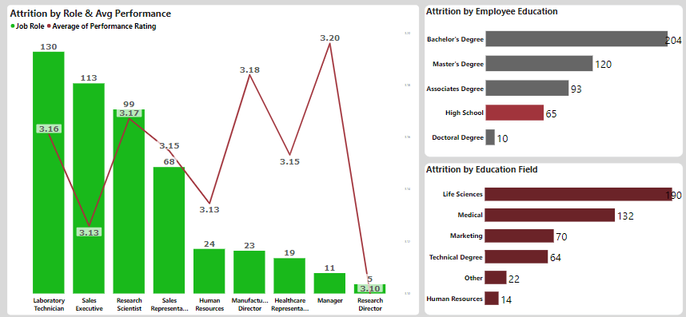
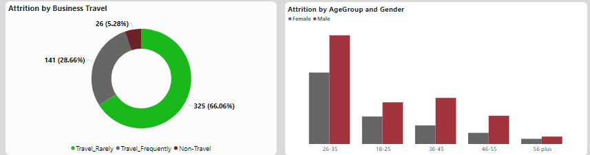

# HR Attrition

### Table of Contents
- [Introduction](#Introduction)
- [Problem Statement](#Problem-Statement)
- [Data Sourcing](#Data-Sourcing)
- [Analysis and Visualization](#Analysis-and-Visualization)
  - [Data Processing](#Data-Processing)
  - [Dashboard Components](#Dashboard-Components)
- [Conclusion and Recommendations](#Conclusion-and-Recommendations)

## Introduction

This project is a Power BI dashboard built to analyze and visualize HR attrition data. The dashboard provides insights into employee attrition patterns, factors influencing attrition, and recommendations to reduce attrition rates.

## Problem Statement

High employee attrition can be costly and detrimental to an organization. This project aims to understand the key drivers of attrition and provide actionable insights to HR and management.

## Data Sourcing

The HR Attrition dataset used in this project was sourced from [this Drive](https://www.youtube.com/redirect?event=video_description&redir_token=QUFFLUhqbUprNm1hYTRUZzRzb1dlWkhWZWxJU1p3V0oxUXxBQ3Jtc0tsdkdmbUFYcG9JUWV4Q0dsN2tOTzNtNWRCeHU5cENYVG80YVhwNWRYYklDQ1hlejJHSUdIdVBoSHhpajN2dExHTG9RNG9DWmU4TmpMalZkQk5oNG5PbDhmeFBFQlFldVRBa3M0T3pyU2R5M294ZXNybw&q=https%3A%2F%2Fwww.t.ly%2FFajA&v=pzLYugB_KcA). It contains information about employees, including their demographics, job roles, satisfaction levels, distance from home, attrition status, and others.

## Analysis and Visualization

### Data Preprocessing

- **Categorization**: Employee distance from home was categorized into three groups: "Far Away," "Far," and "Very Far." Employee work years were grouped for better analysis.
- **Satisfaction Categories**: Employee satisfaction was categorized to understand satisfaction levels better.
- **Age Grouping**: Employee ages were grouped for analysis.
- **DAX Calculations**: Various DAX functions and calculations were applied to calculate total attrition, attrition rate, and other relevant KPIs.

### Dashboard Components

The Power BI dashboard consists of the following key components:

- **Attrition Overview**: Visualizations showing total attrition, attrition rate, attrition by working year, attrition by job role and average performace.
- **Demographics Analysis**: Charts and graphs representing employee demographics and their correlation with attrition.
- **Satisfaction Analysis**: Analysis of employee satisfaction levels and their impact on attrition.
- **Distance from Home Analysis**: Insights into how distance from home affects attrition.
- **Education**: Visualizations and Insights of their education level and fields.

Visuals                           |                          Insights
:--------------------------------:|:--------------------------------------------------------------------------------------------------:
             |  There's a 17% attrition rate among the workforce of 2,925 employees. In terms of job satisfaction, 134 were very dissatisfied and 96 were dissatisfied. Most employees who left had 0-10 years of working experience. Majority of employees who left were male with a total of 312. A total of 296 ex-employees lived close to work and majority of ex-employees were from R&D Department
          |  Maximum average performance of employees were from managers. Only 10 employyes had a Doctoral Degree with with 65 having high school degree. Majority of ex-employees had their education field in Life sciences and medicine while the least of them stdied Human Resource
     |  66.06% of the total attrition traveled rarely while 28.66% of the total attrition traveled frequently, and 5.28% of them never traveled. For each age group, there were more more males than females.

Interact with Dashboard [Here](https://app.powerbi.com/view?r=eyJrIjoiODhiMjY4OTAtZjRlMi00YmYxLWFhZDgtZjY0OTgwMmMyMTE2IiwidCI6ImFiYjU3ODg3LTNmY2ItNDgyNy1iODJiLThiZjU4ZWRjNTlhYSJ9)

## Conclusion and Recommendations

Based on the analysis conducted in this project, the following conclusions and recommendations can be made:

- **Attrition Trends**: Identify periods with the highest attrition rates and investigate factors contributing to attrition during those times.
- **Demographics**: Pay attention to specific demographic groups (age, gender, etc.) that exhibit higher attrition rates and develop targeted retention strategies.
- **Satisfaction**: Focus on improving employee satisfaction through initiatives such as better work-life balance, professional development, and recognition programs.
- **Distance from Home**: Consider offering flexible work arrangements or transportation assistance to employees who live far from the workplace.
- **Regular Monitoring**: Continuously monitor attrition rates and make adjustments to HR policies and practices as needed.

By following these recommendations, organizations can potentially reduce attrition rates and create a more stable and productive workforce.

